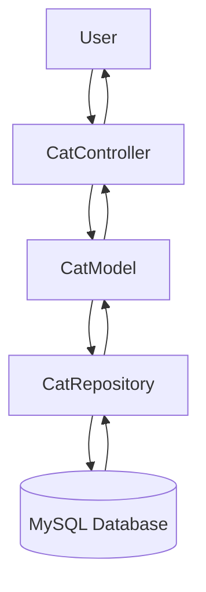

# CATalogue
Welcome to the CATalogue API! This project is a RESTful API built using Spring Boot to manage a cat adoption center. The API allows users to manage cats, including creating, updating, deleting, and retrieving information about the cats available for adoption.

## Features

- **List all cats** in the adoption center
- **Filter cats** based on adoption status (adopted or not adopted)
- **Add new cats** to the adoption center
- **Update cat information** (name, breed, age, gender, adoption status)
- **Delete cats** from the center
- **View specific cat** details by `id`
- **Swagger** integration for API documentation

## Technologies

- **Java** 17+
- **Spring Boot** 3+
- **Spring Data JPA** for database interactions
- **MySQL** as the database
- **Lombok** for reducing boilerplate code
- **OpenAPI/Swagger** for API documentation
- **Maven** for dependency management

## Setup Instructions

1. **Clone the repository and open it in IntelliJ:**

   - Download the project and open it in IntelliJ IDEA.

2. **Download the SQL starter code:**

   - Navigate to the `SQL` folder in the repository and download the starter code.

3. **Run the SQL script:**

   - Execute the SQL script to set up the database.

4. **Adjust database credentials:**

   - Open the `application.properties` file in the `src/main/resources` directory.
   - Update the `spring.datasource.username` and `spring.datasource.password` with your MySQL credentials.

5. **Run the application:**

   - In IntelliJ, click on the "Run" button to start the application.
     
6. **Download the Postman Collection:**

   - Download the `Cat_Adoption_Center_API.postman_collection.json` file from the repository.
   - Import it into your Postman app and try out the available tests.

## API Endpoints

### 1. `GET /cats/`
- **Description**: Fetches a list of all cats in the adoption center.
- **Response**: A JSON array containing details of all the cats.

### 2. `GET /cats/not-adopted`
- **Description**: Fetches a list of all cats that have not yet been adopted.
- **Response**: A JSON array containing details of all the non-adopted cats.

### 3. `GET /cats/adopted`
- **Description**: Fetches a list of all cats that have been adopted.
- **Response**: A JSON array containing details of all the adopted cats.

### 4. `POST /cats/add`
- **Description**: Adds a new cat to the adoption center.
- **Request Body**: A JSON object with the new cat's details:
  - `name`: Name of the cat
  - `breed`: Breed of the cat
  - `age`: Age of the cat (in years)
  - `gender`: Gender of the cat (e.g., Male/Female)
  - `isAdopted`: Boolean indicating whether the cat is adopted or not
- **Response**: A JSON object of the newly added cat, including its auto-generated `id`.

### 5. `GET /cats/{id}`
- **Description**: Fetches details of a specific cat by its `id`.
- **Path Variable**: 
  - `id`: The unique identifier of the cat.
- **Response**: A JSON object with the details of the specific cat.

### 6. `PUT /cats/{id}`
- **Description**: Updates the information of a specific cat by its `id`.
- **Path Variable**: 
  - `id`: The unique identifier of the cat to be updated.
- **Request Body**: A JSON object with the updated cat details:
  - `name`: New name of the cat
  - `breed`: New breed of the cat
  - `age`: New age of the cat
  - `gender`: New gender of the cat
  - `isAdopted`: Boolean indicating the updated adoption status of the cat
- **Response**: A JSON object with the updated details of the cat.

### 7. `DELETE /cats/{id}`
- **Description**: Deletes a cat from the adoption center by its `id`.
- **Path Variable**: 
  - `id`: The unique identifier of the cat to be deleted.
- **Response**: HTTP status code indicating whether the deletion was successful.

## Swagger UI

The **CATalogue API** comes with built-in API documentation using **Swagger**. This allows users to interact with the API through a web-based interface, where you can explore the available endpoints, check request and response formats, and test the API directly.

### Accessing Swagger UI

Once the application is running, you can access the Swagger UI at the following URL:

```plaintext
http://localhost:8080/swagger-ui/index.html
```

## API Workflow Diagram



- The **User** interacts with the **Controller**.
- The **Controller** processes the request using the **Model**.
- The **Repository** performs the necessary operations on the **Database**, and the results flow back through the same chain.

